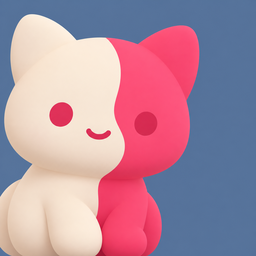
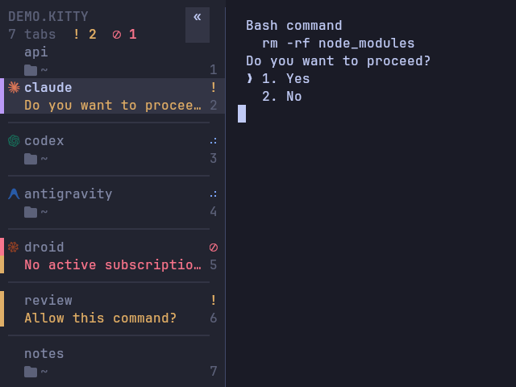
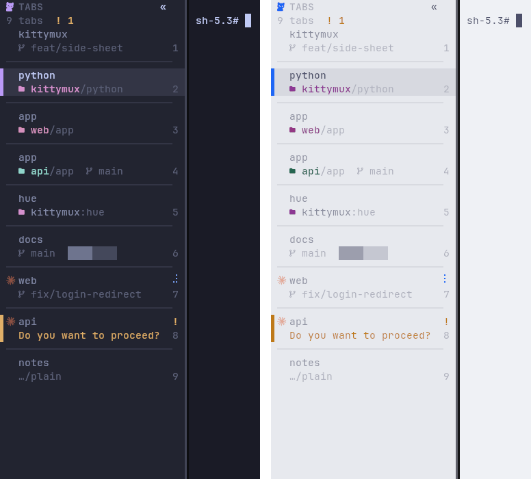

<p align="center">
  
</p>

# kittymux

**Run a herd of AI coding agents in [kitty](https://sw.kovidgoyal.net/kitty/) — and always know which one needs you.**

A vertical tab bar, a sidebar deck and a few keystrokes that turn kitty into an
agent-aware workspace: named sessions, per-agent git worktrees, live
`working` / `waiting` / `done` status, and a one-key jump to whichever agent is
blocked on you. A *config layer*, not a daemon — Linux, Wayland, Hyprland-friendly,
no always-on background daemon.

<p align="center">
  
</p>

## Try it in 30 seconds

```sh
git clone https://github.com/KitsuneKode/kittymux ~/kittymux
~/kittymux/bin/kittymux demo
```

`demo` opens an isolated window (its own config, state and theme — your kitty
config is never touched) with a sample session and a couple of fake agents in
different states. Press `ctrl+alt+b` for the deck, `ctrl+alt+y` to jump to the waiting agent,
`ctrl+space` then `?` for leader mode. Close the window and it is gone.

More to try (panes by number, clickable `file:line`, scrollback keys, the keymap overlay, resize) and what needs a restart: [docs/try-it.md](docs/try-it.md). The full guides — every key, the tab bar, agents, sessions, troubleshooting — start at [docs/index.mdx](docs/index.mdx).

Like it? Install:

```sh
~/kittymux/install.sh            # add --leader for tmux-style leader mode; also links `kittymux` into ~/.local/bin
kittymux doctor                  # tells you exactly what (if anything) is off
kittymux hooks --install         # Claude Code status hooks (backup first)
kittymux screenshot              # …and the rest: dim, layout, upgrade (see `kittymux help`)
```

If `kittymux` is "not found", `~/.local/bin` is not on your `PATH`: add `export PATH="$HOME/.local/bin:$PATH"` to your shell profile (the installer says so).
`kittymux uninstall --yes` removes the command along with everything else it added.

## What you get

- **A tab bar that reads like a workspace list.** Vertical rows (or a slim bottom bar):
  agent logo, title, git branch, pane count, and one status glyph — **◐ working**,
  **◆ waiting on you**, **✓ done** (shape *and* colour, so it is readable without colour vision).
  Every colour is derived from *your* kitty theme, so it follows theme switches.
- **Quiet tool glyphs.** Agents get their brand logo; recognised tools get their *real* logo rendered muted — bun, docker, kubernetes, rust, go, python, node, git, neovim, postgres, deno, pnpm, yarn, npm (all built into the bundled icon font); a plain shell stays blank — so the icon column tells you what is running without adding noise.
- **The sidebar deck** (`ctrl+alt+b`). Every tab across every session, grouped, with live
  pane preview, hover/click, the agent's own message ("Approve: rm -rf node_modules?"), the
  PR number and listening ports (`:3000`).
- **A docked sidebar panel** (`ctrl+alt+shift+b`, Wayland). The deck as a persistent left column via
  `kitten panel`: the compositor reserves its width so tiled windows sit beside it — the cmux-style
  always-visible sidebar. ~1% CPU idle.
- **An attention queue** (`ctrl+alt+y`). One key jumps to the agent that has been waiting the
  longest — across sessions and OS windows. A desktop notification fires when an unfocused
  agent starts waiting.
- **Worktree per agent** (`ctrl+alt+shift+g`). Pick an agent, name a branch: kittymux creates
  `.worktrees/<branch>`, opens a tab and starts the agent there. Parallel agents never share a
  working tree.
- **Sessions that survive.** Tabs belong to named sessions; switching *parks* the current one
  (processes stay alive) and auto-checkpoints it. `ctrl+shift+space` is Kitty Home.
- **Leader mode** (opt-in). Tap `ctrl+space`, then one key — no modifier chords fighting your
  window manager. The bar shows a LEADER badge while armed; `?` shows the card.
- **Honest usage HUDs.** Real local numbers or "unavailable" — never fabricated. Network is opt-in.
  The overlay paints instantly — skeletons first, then each provider fills in as its collector
  lands; slow live quota fetches merge last. Errors and timeouts surface per-row, not as a hang.

### How is this different?

| | kittymux | [cmux](https://github.com/manaflow-ai/cmux) | [herdr](https://terminaltrove.com/herdr/) |
|---|---|---|---|
| What it is | config layer for kitty | its own macOS terminal (Ghostty-based) | multiplexer that runs *inside* a terminal |
| Platform | Linux (Wayland/X11) | macOS | cross-platform |
| Your terminal | stays kitty (GPU, ligatures, kittens) | replaces it | any |
| Always-on daemon | none (scripts + kitty's own API) | app | one binary |
| Agent state | hooks → window var (+ heuristic fallback) | notifications/hooks | process detection |

Pick the one that fits how you work; kittymux is for people who already live in kitty and don't
want a second multiplexer between them and their terminal.

## Install (details)

```sh
git clone https://github.com/KitsuneKode/kittymux ~/kittymux
~/kittymux/install.sh
```

The installer verifies deps (`kitty ≥ 0.48`, `jq`, `python3`, `fzf`, `git`), backs up
`kitty.conf`, adds the `include` lines, and symlinks `tab_bar.py` plus the helper modules.
Nothing is overwritten (existing files are backed up). Re-running is safe. Reload with
`ctrl+shift+alt+r`; a *new* kitty window picks up the tab bar (kitty caches a running
instance's `tab_bar.py`).

Add a remote-control socket if you don't have one:

```conf
allow_remote_control socket-only
listen_on unix:${XDG_RUNTIME_DIR}/mykitty
```

Both lines are deliberate: `socket-only` stops programs *inside* a terminal (an agent's tool output, a file you `cat`) from controlling kitty with an escape sequence — plain `yes` allows
that — and the runtime directory is private to you, unlike `/tmp`. kittymux works fully with this setting (every smoke test runs under it); `kittymux doctor` flags `yes` and a `/tmp` socket.
See [SECURITY.md](SECURITY.md).

Arch: `packaging/PKGBUILD` builds `kittymux-git`.

## The mental model

```
OS window ──┬── session: work      (visible — bar shows these tabs only)
            ├── session: research  (parked — alive, hidden, auto-saved)
            └── session: misc      (parked)
```

- **Session** = a named group of tabs for one project/workspace.
- Switching sessions *parks* the current one — tabs and processes stay
  alive — and **auto-checkpoints** it to disk if it was saved before.
- `ctrl+shift+space` opens **Kitty Home**: one picker for every session
  op — jump, restore, create, rename, delete.

## Keymap spine

| Keys | Action |
|---|---|
| `ctrl+shift+space` | Kitty Home — all session ops |
| `ctrl+alt+,` / `ctrl+alt+.` | prev / next session |
| `ctrl+alt+shift+a` | last session |
| `ctrl+alt+t` / `+shift` | new tab beside / at end |
| `shift+←` / `shift+→` | prev / next tab (session-scoped) |
| `ctrl+alt+shift+←/→` · `↑/↓` | move the tab — arrows follow the bar: ←/→ on a horizontal bar, ↑/↓ on a vertical one (both always work) |
| `ctrl+alt+1..9` · `alt+1..9` | jump to tab N (session-scoped) |
| `ctrl+alt+\`` | flip to previously active tab (MRU) |
| `ctrl+alt+h j k l` | pane nav (`shift+alt+arrows`) · `ctrl+alt+o` last pane |
| `ctrl+alt+shift+1..9` | focus pane **N** of this tab straight away (the digit `ctrl+alt+e` draws on each pane) |
| `ctrl+alt+shift+j` | **join**: move this tab's panes into another tab as splits, keeping their shape — you pick the tab in a list (its keys are in its footer; `kittymux join` from a shell) |
| `ctrl+alt+e` · `ctrl+alt+shift+y` | number every pane on screen, press its digit to **focus** it · to **swap** with it (tmux's display-panes) |
| `ctrl+alt+v` | **pick**: what needs you (longest-waiting first), every running agent, conversations you closed, a new agent — one searchable list (`kittymux pick --menu rofi` from your window manager) |
| `ctrl+alt+shift+o` then `c` `x` `d` `u` `o` `a` `g` | **spawn** claude · codex · devin · cursor · opencode · agy · grok in a new tab (`shift` + letter: split right) in the current directory |
| `ctrl+alt+shift+u` | reopen the agent conversation you closed last (it asks before resuming) |
| `ctrl+alt+enter` · `ctrl+shift+enter` | split below · split to the right |
| `ctrl+alt+d` / `+shift` | pane → new tab / chooser · `ctrl+alt+shift+c` shows/hides pane title bars (the drag handles) |
| `ctrl+alt+z` / `0` | zoom pane / equalize |
| `ctrl+alt+i` (×2) | cwd pill → detail card (copy path/branch) |
| `ctrl+alt+u` | agent usage HUD |
| `ctrl+alt+g` | agent picker — every agent pane, live preview + status + message |
| `ctrl+alt+y` | jump to the next agent waiting on you (round-robin, longest-waiting first) |
| `ctrl+alt+shift+q` | **quick look**: the peek card of the agent that has waited longest, without leaving this tab (`⏎` goes there, `esc` stays; `kittymux peek [TAB_ID]` for any tab) |
| `ctrl+alt+shift+g` | new agent in its own git worktree + tab |
| `ctrl+alt+b` | sidebar deck — tabs grouped by session, hover/click, live pane preview (`J`/`K` jump sessions · `/` search by title, branch, folder, agent, state or message · `a` pulls the selected tab's panes into this tab · `t` turns the hovered/focused pane into its own tab) |
| `ctrl+alt+shift+b` | **docked sidebar panel** — the deck as an always-visible left column that reserves screen space (Wayland/Hyprland) |
| `ctrl+alt+;` | send a prompt to a background agent pane |
| `ctrl+alt+shift+e` | move the tab bar: left → bottom → top → right (this kitty only) |
| `ctrl+alt+\` | bar mode: full → slim rail → hidden ("zen") |
| `ctrl+alt+shift+[` / `]` | narrower / wider sidebar |
| `ctrl+alt+shift+l` | pick a layout preset (sidebar, rail, right-sidebar, bottom, top, zen) |
| *drag the bar's inner edge* | resize the vertical bar with the mouse |
| `ctrl+alt+/` | keymap overlay — this table, parsed live from your conf |
| `ctrl+alt+shift+/` | last command output in pager |
| `ctrl+alt+[` / `]` | jump between shell prompts in scrollback |
| `ctrl+alt+PgUp` / `PgDn` · `ctrl+alt+Home` / `End` | scroll the scrollback a page · to the oldest output / back to the live screen |
| *kitty's own, still on* | `ctrl+shift+↑↓` or `j k` a line · `ctrl+shift+z` / `x` prompts · `ctrl+shift+h` scrollback in a pager (`/` searches) · `ctrl+shift+g` last command's output · `ctrl+shift+e` open a URL by letter · `ctrl+shift+p` then `n` pick a `file:line` · `ctrl+shift+f3` command palette (search every action) |
| `alt+shift+hjkl` | resize pane |
| `ctrl+alt+q` | close pane (confirms if a process runs) |
| `ctrl+alt+shift+s` | save session now |
| `ctrl+space` then a key | **leader mode** (opt-in: `install.sh --leader`) — `?` shows the card |

When tmux is focused, only the keys tmux actually binds pass through
(`shift+←/→`, `ctrl+alt+←/→`, `ctrl+alt+z`) — everything else stays kitty's.
On Hyprland's scrolling layout the `ctrl+alt+` layer is WM-owned — kittymux
uses `ctrl+alt+g` (not `+a`), `shift+alt+arrows`, `ctrl+alt+0`, `ctrl+alt+q` so
nothing gets silently swallowed.

## Spawn, pick, reopen, mute

`ctrl+alt+shift+o` then `c`/`x`/`d`/`u`/`o`/`a`/`g` starts claude/codex/devin/cursor/opencode/agy/grok in a new tab (with `shift`: a split) in the current directory — `kittymux spawn claude,codex,devin` opens several.
`ctrl+alt+v` (or `kittymux pick --menu rofi` bound in your window manager) is one searchable list of what needs you (longest-waiting first), every running agent, conversations you closed and a new agent;
`ctrl+alt+shift+u` reopens the one you closed last. `kittymux notify mute 1h` / `kittymux snooze 1h` quiet popups and bells without losing anything (the inbox keeps it all). `alt+p` pins a conversation to the top of the list (never aged out), `alt+s` settles it away (old closed ones settle after 3 days). The bar shows how long a tab has been waiting/working (`1m !`) and flags agents started with approvals off (`⚠`). [docs/launcher.md](docs/launcher.md)

## Agent status



Every tab with an agent in it shows exactly one of these, and the tab bar, the deck, the docked
panel and the `ctrl+alt+y` jump queue all show the *same* one:

| Glyph | State | Meaning |
|---|---|---|
| ⠋⠙⠹… (animated) | **working** | the agent is busy — the spinner runs at 10 fps, on any window |
| **!** | **waiting** | it is asking you something (a permission prompt, a question) — the question is shown as the reason |
| **⊘** | **limited** | usage limit / quota exhausted — nothing will happen until you act |
| ✓ | **done** | it finished while you were looking elsewhere; clears the moment you focus it |
| *(nothing)* | idle | an agent is running but not doing anything |
| • | unread | output arrived in a tab that has no agent |

**How it knows.** Twice a second (every 2 s when no agent is running) kittymux looks at the
bottom of each *agent* pane's screen for the markers real agents print — `esc to interrupt`,
`Do you want to proceed?`, `usage limit reached` — and combines that with hook status when you have
hooks. A state needs positive evidence: a quiet title is **never** read as "waiting", an agent you
interrupted does not spin forever, and a "waiting for your input" idle notification is not a request.
Works for Claude, Codex, Devin, Gemini, Cursor, OpenCode, Amp, Antigravity (`agy`) and Factory `droid`
with no setup; the others with a logo (grok, qwen, kimi, goose, kilo, vibe, junie, auggie) and aider/crush
use hooks or title activity. Logos are the real brand marks, compiled into the bundled icon font.
The design follows how t3code's sidebar resolves thread status: one ordered
resolver (limited › waiting › working › done › idle), "done" only while unseen.

**Splits.** A split tab shows a to-scale **mini-map** of its panes under its title (a row of quadrant blocks: left/right and top/bottom splits at their real proportions, each pane tinted by its state — amber waiting, blue working, red limited — the focused one brighter), and lists each agent pane on its own: in the deck/panel as indented child lines
(`├ ◆ claude !`, `└ ⠋ codex`) you can hover (live preview of *that* pane) and click (focus it); in the bar as
`logo + state` chips under the tab. The tab itself shows the most important state of all its panes, and
jumping to a tab that needs you lands on the pane that is asking. kitty rings a waiting split with its bell border.

### Where is this tab?



Under each tab the bar says **where it is**: `project[:worktree]/inner  branch`. The project name is the one bright thing on the line (in the
project's own colour on the active tab); the path and branch step down. The colour is a calm tint turned from your theme's accent and kept
clear of the state colours (needs you, running, done), so a project never looks like a state — and the name is always written, the colour is
never the only cue.

- Two tabs that show the same title (`app` and `app`) get their project emphasised, so you can tell them apart at a glance.
- A tab whose title already says the project (a shell titled by its folder, an agent titled `Claude:web`) shows its branch, path or worktree
  instead of repeating the name.
- Narrow bar? The branch goes first, then the path; a long name is cut in the middle (`kit…ux:hue`), never dropped.
- The slim rail has no room for a line, so it tints the tab number with the project's colour.
- **Pane title bars** (`ctrl+alt+shift+c` shows them on every pane of a split tab) carry the same line — `alpha/src/ui  ⑂ main  ·  nvim README.md` — in colours
  derived from the bar's own, so they read on any theme: the focused pane's project is bold, an empty or repeated pane title is left out, and
  `kittymux features off panetitle` hands the bars back to kitty's own title. Renaming a tab never changes them (a tab name and a pane title are different things).

### Pick what you want

Every optional piece is its own switch — use all of it, some of it, or none (the last two are planned: the switch is saved, nothing reads it yet):

| Switch | What it does | Default |
|---|---|---|
| `folder` | the project/branch line under each tab (off: just the branch, as before) | on |
| `hue` | a stable colour per project, derived from your theme's accent | on |
| `collide` | emphasise the project of tabs that show the same title | on |
| `sheet` | the side sheet — **planned, no effect yet** | planned |
| `hover` | open the sheet on hover — **planned, no effect yet**; kitty sends the bar no idle mouse motion, so it can only live inside the sheet | planned |
| `panetitle` | the same line in each pane's title bar, then the pane's own title (`ctrl+alt+shift+c` shows the bars; kitty ≥ 0.49.2) | on |

```bash
kittymux features                 # what is on, and where each setting comes from
kittymux features off hue         # one piece off (flag file in ~/.local/state/kittymux)
kittymux features preset minimal  # folder line only   (presets: minimal · default · full)
KITTYMUX_HUE=off kitty            # or per process, by environment — the environment wins
```

### When you are elsewhere

Everything below only fires for an agent **you are not looking at**; focusing it clears it.

| Cue | When | Turn it off |
|---|---|---|
| tab glyph + rail stripe | any tab, any pane of it (a question in a split you are not in still lights the tab) | — |
| header badges `! 2  ✓ 1` | agents that need you / finished unseen, across **all** tabs of the window (vertical header and horizontal prefix) | — |
| desktop notification, "needs you" / "hit a limit" | an agent starts waiting or hits its limit; shows the question | `touch ~/.local/state/kittymux/notify-off` or `KITTYMUX_NOTIFY=0` (everything) |
| desktop notification, "finished" | a run of ≥ 15 s ends unseen (quick replies stay quiet; a window seen for the first time never notifies) | `touch ~/.local/state/kittymux/notify-done-off` or `KITTYMUX_NOTIFY_DONE=0` |
| window-manager urgency (taskbar flash / urgent border) | an agent starts waiting or hits its limit — kitty's own bell path, so it follows your `window_alert_on_bell` / `enable_audio_bell` | `touch ~/.local/state/kittymux/bell-off` or `KITTYMUX_BELL=0` |
| `ctrl+alt+y` | jump to the next agent that needs you, longest-waiting first | — |

kittymux owns notifications: the agents' own desktop notifications (Claude Code's "waiting for your input", Codex's,
Devin's…) are dropped with a `filter_notification` rule in `kittymux.conf`, so each event notifies **once**. Delete that
line to let them through again; kitty's own "command finished" notice is untouched.

Every notification wears **its agent's own mark** (Claude, Codex, Devin, Droid, Antigravity…; `assets/notify/`), with the
kitty icon as the fallback. They are rate-limited (one per window per 10 s, five in total per 10 s). Because they show a line
of your screen ("Approve: rm -rf x?"), `touch ~/.local/state/kittymux/notify-private` reduces them to "<agent> needs you".
How native, agent and kittymux notifications interact — and the security model and known limits — is in
[docs/notifications.md](docs/notifications.md).

Notifications carry a **Jump to it** action (`bin/mux-notify`): with a daemon that supports actions
(dunst: middle-click or `dunstctl action`; mako, swaync: click) it focuses that window — through kitty's
remote control, then `hyprctl` on Hyprland. A daemon without actions still shows the text. Each
notification process lives at most 30 s.

*Privacy:* only the matched marker and one short line of context (≤ 100 chars, control characters
stripped) are kept, in `scan-<pid>.json` (mode 0600, inside the 0700 state dir). Nothing leaves your machine.

> **A notification never takes your focus.** If your compositor focuses windows that request attention (Hyprland `misc:focus_on_activate`), a bell would jump you to that window and workspace;
> kittymux detects this and turns the bell request off (see [docs/notifications.md](docs/notifications.md)). Override with `touch ~/.local/state/kittymux/attention-on`.

### Sessions that come back — with their conversations

`ctrl+alt+shift+s` (or `kittymux sessions save NAME`) saves with kitty's own `save_as_session` and then rewrites every agent window to its resume command — `claude … --resume <id>`,
`codex resume <id>`, `grok --resume`, `droid -r`, `agy --conversation`, … — keeping the flags it was started with — and a restored agent window **asks** first (Enter resume · n new · s shell · a all; `KITTYMUX_RESUME=auto` skips the question). kittymux **autosaves** too (`kittymux sessions restore last` after a crash or a
reboot). `kittymux sessions new api --template agent` makes a ready project session (templates: plain, agent, duo, review). Nothing is guessed: each CLI's own `--help` is probed first, ambiguous
cases (two windows, no exposed id) are restored as saved rather than opening one conversation twice, and `kittymux sessions list` shows what would happen and why. Details, the per-agent table and how
to add an agent: [docs/sessions.md](docs/sessions.md). Every agent session is also **journaled** as it runs (`kittymux sessions history` for the numbers, `kittymux sessions recover`
after a crash).

### The inbox — questions, permissions, usage limits, finished runs

Everything that wants your attention is a typed event in one private store — what the agent announced **itself** (its own OSC 9/99 notification, captured natively from kitty's notification
pipeline), its hooks, and what the screen shows — de-duplicated into one event and one popup per occurrence. `kittymux inbox` lists them (`!` needs you, `⊘` a limit with its reset countdown),
`kittymux inbox jump` focuses the one that needs you, `ack`/`clear` tidy up, focusing a window acknowledges it. A completion is a popup only if the agent said it finished itself (or the run was
long); a finish inferred from a quiet screen is in the inbox and the bar but does not interrupt you. `~/.local/state/kittymux/inbox-snapshot.json` is the stable file a shell panel watches:
see [docs/inbox.md](docs/inbox.md) and the Quickshell sample in [`addons/quickshell/`](addons/quickshell/README.md) (a sample against the documented contract; untested here).

### `kittymux explain` — why is it in that state?

A "finished" or "needs you" you did not expect is now diagnosable instead of a guess:

```
$ kittymux explain
kitty 4062
  win 77    claude       working  Kitty lightweight tm         the screen shows a busy marker
  win 192   codex        limited  Audit codebase securit       the screen shows a usage-limit message

  recent decisions (oldest first):
  23:58:31  win 77    claude     idle → working       the screen shows a busy marker
  00:03:02  win 77    claude     working → done       its Stop hook fired
  00:03:07  win 77    claude     notify done          sent (worked 271 s)
  00:09:40  win 18    claude     notify done          suppressed: worked only 4 s (< 15 s)
```

Every state change and every notification decision — sent, or the reason it was held back (you were looking at it, switched off, rate limit, too short, duration unknown) — is recorded. `--window ID` filters,
`--last N` sets how many, `--all` covers every running kitty, `--json` is for scripts. The log is a bounded in-memory ring (300 events) plus a private (0600) file per kitty that rotates at 192 KB; it holds
reason codes and window ids, never screen text.

## Agent status hooks (optional)

Hooks add what the screen cannot say — the exact message an agent is waiting on and instant
transitions — and are used as an input alongside the screen.

```sh
kittymux hooks --install      # merges the Claude Code hooks into ~/.claude/settings.json (backup first, idempotent)
kittymux hooks --remove       # takes exactly those entries back out (backup first; every other hook untouched)
kittymux hooks                # or just print the snippet
```

`bin/mux-status <working|waiting|done|idle>` is what the hooks call. It sets two window
variables — `kittymux_status` and `kittymux_msg` — that the watcher records and the bar
redraws on instantly. The message comes from `--msg`, from the hook's JSON on stdin
(Claude Code `Notification` → `.message`) or from a JSON last argument (Codex `notify` →
`.last-assistant-message`). It writes the OSC 1337 `SetUserVar` escape to the tty (works
over ssh, no socket needed) and falls back to kitty remote control. It never blocks or
fails the agent.

Notifications and the "elsewhere" cues are covered under [Agent status → When you are elsewhere](#when-you-are-elsewhere).

Claude Code hooks, by hand:

```json
{
  "hooks": {
    "UserPromptSubmit": [{ "hooks": [{ "type": "command", "command": "~/kittymux/bin/mux-status working" }] }],
    "PostToolUse":      [{ "hooks": [{ "type": "command", "command": "~/kittymux/bin/mux-status working" }] }],
    "Notification":     [{ "hooks": [{ "type": "command", "command": "~/kittymux/bin/mux-status waiting" }] }],
    "Stop":             [{ "hooks": [{ "type": "command", "command": "~/kittymux/bin/mux-status done" }] }],
    "SessionEnd":       [{ "hooks": [{ "type": "command", "command": "~/kittymux/bin/mux-status idle" }] }]
  }
}
```

Other agents: call `mux-status` from whatever hook/notify command they offer (extra arguments
are ignored). Inside tmux the escape needs passthrough; kittymux then falls back to remote
control (`listen_on` required).

## Leader mode

`install.sh --leader` (or `--leader=ctrl+a`) adds a tmux-style prefix built on kitty's modal
mappings: tap the leader, then **one** key. Unmapped keys or 2 s of silence cancel it, and the
tab bar shows a LEADER badge while it is armed.

| after leader | |
|---|---|
| `h j k l` `o` | focus pane · last pane |
| `\` `-` `z` `=` `x` `d` | split right/down · zoom · equalize · close pane · pane → tab |
| `c` `n` `p` `1…9` `r` `X` | new / next / prev / Nth tab · rename · close tab |
| `s` `P` | Kitty Home · project picker |
| `a` `w` `g` `;` | agent picker · **next waiting agent** · new worktree agent · send prompt |
| `b` `B` `u` `i` `e` | sidebar deck · docked panel · usage HUD · location pill · bar edge |
| `?` | the full card, generated from your leader config |

The default leader is `ctrl+space`. If you use nvim-cmp (which binds `<C-Space>`), pick another
with `--leader=ctrl+a`.

## Theme & colours

Nothing is hardcoded to a palette. `python/kittymux_theme.py` derives every
colour from your live kitty theme — pane, sidebar tint, active row, separator,
status colours (from the ANSI slots, contrast-checked) — so it follows theme
switches. Set `KITTYMUX_ACCENT=#rrggbb` to pin the accent (default: your
theme's `active_border_color`).

## Agent usage collectors

`python/collectors/*.py` — one file per provider, auto-discovered:

```python
def collect() -> dict:       # pure local reads, no spawns
def live(cached) -> dict:    # optional, only when KITTYMUX_USAGE_LIVE=1
```

Ships with codex (rollout rate-limit snapshots), claude (reconstructed
5h billing window + weekly burn), cursor (plan + AI-lines share), devin
(session/token activity). Add your own by dropping a file in — a broken
collector can never kill the HUD.

With `KITTYMUX_USAGE_LIVE=1`, collectors that expose `live()` also fetch
real quotas, cached ≥5min: claude via the OAuth usage endpoint, cursor via
`DashboardService/GetCurrentPeriodUsage` (monthly auto/api model pools +
spend), devin via `SeatManagementService/GetUserStatus` (daily/weekly
quota + overage balance). Network is strictly opt-in — everything works
offline. Failed requests also back off for five minutes; previous quota rows remain visible
with an unavailable/stale diagnostic. Authentication is sent through curl's stdin, not its
process arguments.

The local five-hour Claude bar is **elapsed time, not quota consumed**. Daily token charts use
exact, dated Claude log counters; old rolling-week totals are excluded rather than relabeled
as daily burn. Devin's local activity shows cumulative totals for sessions modified today,
not exact daily consumption, so it is not recorded in the daily-burn chart.

## Tab bar layout & resizing

Layout is **per kitty instance** (all OS windows of one kitty share it), takes effect
instantly and survives config reloads: `kittymux layout <mode|edge|width|preset|pick|default|show>`.
A new kitty starts the way you last left one (and with your own kitty.conf if you never chose a layout); `kittymux layout default` pins a layout as the start instead, `kittymux layout default clear` goes back to following your last choice.

**Layout shortcuts** (all act on this kitty only):

| | |
|---|---|
| `ctrl+alt+\` | full sidebar → slim icon rail → hidden ("zen") → back |
| the `«` / `»` button | full sidebar ⇄ rail (the glyph is bare, but the click area around it is two rows tall and a few cells wide) |
| `ctrl+alt+shift+e` | move the bar: left → bottom → top → right (vertical sidebar or horizontal bar, top included) |
| `ctrl+alt+shift+l` | pick a preset: sidebar, rail, right-sidebar, bottom, top, zen |
| `ctrl+alt+shift+[` / `]` · drag the edge | narrower / wider sidebar |
| `kittymux layout …` | the same from a shell: `mode`, `edge top`, `width 30`, `preset rail`, `show` |

**Collapse button.** The header row of the vertical bar ends in a `«` button: click it and the sidebar
shrinks to the 9-column icon rail (just each tab's logo, number and state mark, plus the `!2 ⊘1` badges) (like shadcn's collapsible sidebar); the rail's header row is a `»`
that brings the full sidebar back at the width it had. It acts on mouse-up, like a button, and never
activates a tab. `ctrl+alt+\` still cycles full → rail → hidden from the keyboard.

**Drag to resize.** On kitty ≥ 0.49.2 the divider is drawn by kitty's own border renderer (two pixel-exact hairlines in the pane padding beside the bar) and in any tab with split panes the pointer over it is kitty's **native resize arrow** and the drag is kitty's own divider drag (the panes' programs get the final size once, not every step). A single-pane tab has no borders for kitty to hit-test, so there the bar's last column is the grab zone and the cursor stays kitty's hand. Older kittys draw the divider with cells. The vertical bar is divided from your panes by a two-tone edge — a firm tone-700 hairline and, right beside it, a near-black tone-950 one (~7 px in all), both derived from your theme (`kittymux_theme.shade`) — with a thin hairline between tabs. Grab the divider (the hit area is centred on the two hairlines and spans the bar's last two columns, ~30 px at a 15 px cell — it never reaches into the tab content, so clicking a tab number still just switches tabs; the divider lights up while you
drag) and pull. The pointer is captured for the drag, so it works even outside the bar; release
saves the width for this kitty. Constraints:

- never narrower than 16 columns (a drag from the 9-column rail promotes it to the full sidebar);
- never wider than a third of the window — kitty's own cap for vertical bars — or 60 columns;
- a drag that goes silent for 2.5 s is abandoned, so the mouse can never stay captured.

Tab titles show only what fits. kitty does not deliver hover events to its tab bar (tested), so the
preview gesture is a **right-click on a tab**: a peek card opens over the active window with the tab's
state and the question it is asking, branch, folder, its panes, and the tail of its screen. `⏎` jumps there
(to the pane that is asking, if one is), `esc` or a click closes it. The deck (`ctrl+alt+b`) and the docked
panel (`ctrl+alt+shift+b`, also drag-resizable) do get real hover: moving over a tab or pane previews its screen (beside the list in the wide deck, in a drawer under the list in the narrow panel). Set `KITTYMUX_DEBUG=1` to log drag errors to `barsize-debug.log`.

### Reordering tabs, and moving splits ↔ tabs

Kitty has native drag and drop; kittymux makes it work in the vertical bar:

- **Reorder tabs** — press and drag a tab in the bar. A tab swaps once you pass the middle of the one you're crossing, so the order follows your hand instead of jumping (kitty's own drag teleported the grabbed tab to the top and cascaded swaps between tabs of different heights; both are fixed and covered by a real-pointer test). (Kitty used to treat the blank line between
  vertical tabs as "no tab", so dragging over it threw the tab to the end of the list; the gap now
  belongs to the nearer tab, and clicking it selects that tab.)
- **Split → tab** — fastest: `ctrl+alt+d` (focused pane → new tab), or `t` in the deck. By mouse: press `ctrl+alt+shift+c` to show a thin title bar on every pane (they are hidden
  otherwise, so splits stay clean), drag one onto **"+"** or empty bar space to turn that split into its
  own tab, then press the key again to hide the bars.
- **Tab ← split** — drag a pane's title bar onto **a tab in the bar** to move the split into that tab.
- **Re-split** — drop it on another pane's edge to insert it there, or on that pane's title bar to swap.
- **Keyboard** — `ctrl+alt+d` pane → new tab · `ctrl+alt+shift+d` pane → a tab you pick (a one-pane tab
  moved this way *is* "tab → split") · `ctrl+alt+shift+j` this whole tab → a tab you pick, as splits, keeping its shape (type to filter, ↑/↓ or hover to choose, `⏎` or a click joins, `Tab` picks the side, `Ctrl+T` flips whole tab / only this pane, `Esc` clears the filter, then closes) · `ctrl+alt+shift+←/→` or `↑/↓` move the tab itself.

- **Tab → split (pull it in)** — open the deck (`ctrl+alt+b`, or the docked panel), select a tab and press
  **`a`**: all of its panes become splits of the tab you are in, and the emptied tab closes. Undo with
  `ctrl+alt+shift+d` on a pane. (kitty has no gesture for dropping a whole *tab* onto a pane.)

### Click a `file:line`, dim the inactive pane, take a screenshot (kitty ≥ 0.49.2)

- **`src/app.py:42` is a link.** `ctrl+shift+click` it (in an agent's output, a compiler error, a stack trace) and it opens in `$VISUAL`/`$EDITOR`
  at that line (`nvim`/`vim`/`nano`: `+42`; `hx`/`micro`/`zed`: `file:42:7`; `code`/`cursor`: `--goto`). Relative paths resolve against the pane's folder,
  then its git root. The text is validated and never run by a shell; a missing file opens nothing. `install.sh` links `open-actions.conf` for you only
  if you have none (yours is never touched; otherwise it prints the two lines to add).
- **`kittymux dim on|off|toggle`** dims the panes that are not focused, kitty's own `dim-inactive-windows` shader (0.49.2 stopped it dimming the tab bar). Off by default;
  needs the `shader-slang` package (kitty compiles shaders with `slangc`) — without it the command says so instead of failing on every reload.
- **`kittymux screenshot [--tab|--window] [file]`** — a PNG rendered by kitty itself (default `~/Pictures/kittymux-<time>.png`, mode 0600: it can show anything that was on screen).

On kitty 0.49.1 none of these options are written to your config at all (they would be config errors there); `kittymux doctor` suggests updating — 0.49.2 also fixes a
file-transfer confirmation bypass.

## The keymap overlay (`ctrl+alt+/`)

Every key, mouse gesture and `kittymux` command in one place, read live from your generated conf so it cannot drift. **Just type to search** (all words must match, any of
section / key / description), `↑↓ j k` or the wheel scroll, `PgUp/PgDn`/space/`b` page, `g`/`G` ends, **`esc` clears the search first and then closes**, as do `q` and pressing
`ctrl+alt+/` again. 1, 2 or 3 columns by width. kitty can only bind a *chord*, never a held modifier, so there is no "hold ctrl+alt to show it" — the overlay is one chord away.

**Panes by number:** `ctrl+alt+e` draws a digit on every pane of the tab (tmux's display-panes) and the digit focuses it; `ctrl+alt+shift+1..9` jumps straight to pane N without the
overlay (same numbers). Want letters instead? `visual_window_select_characters asdfghjkl` in your kitty.conf; the direct keys stay numeric.

## Upgrading

```sh
git pull && kittymux upgrade     # refreshes the links, reloads every running kitty twice, runs doctor
```

Reloading is enough for the tab bar, scanner and helpers — your sessions and processes are untouched.
(`pane-state.py` itself is cached by kitty for the life of the process; it now only holds hook state, so
nothing user-visible depends on restarting.)

## Layout

```
kittymux/
├── kittymux.conf          # options (path-free)
├── kittymux-keys.conf.tpl # keybinds → rendered by install.sh
├── install.sh
├── lib/mux.sh             # session model + remote-control plumbing
├── bin/mux-*              # sessionizer, nav, cycle, agents, save, HUDs…
├── bin/mux-status         # agent hooks → window status (working/waiting/done)
├── tests/                 # python3 -m unittest discover -s tests
└── python/
    ├── tab_bar.py         # custom tab bar (horizontal + vertical rows)
    ├── sidebar-kit.py     # ctrl+alt+b deck kitten (hover/click/preview)
    ├── pane-state.py      # watcher: per-window activity + agent status
    ├── kittymux_theme.py  # colour tokens derived from your kitty theme
    ├── kittymux_agents.py # agent table, glyphs, status lookup
    ├── kittymux_state.py  # screen markers + the ordered state resolver (pure, tested)
    ├── kittymux_scan.py   # in-kitty scanner, spinner clock, notifier (timers never stack)
    ├── kittymux_layout.py # per-instance bar layout (geninclude) + drag maths
    ├── kittymux_barsize.py# drag-to-resize the vertical bar
    ├── kittymux_git.py    # branch/worktree reader (no subprocess)
    ├── kittymux_deck.py   # deck grouping/layout logic (pure, tested)
    └── collectors/        # usage plugins (_common.py shared helpers)
```

State lives in `${XDG_STATE_HOME}/kittymux` (`0700`, files `0600`).
Override with `KITTYMUX_STATE`. Optional vars: `KITTYMUX_PROJECTS`
(picker root), `KITTYMUX_USAGE_LIVE=1` (opt-in network quota fetch).

## Testing and known limits

See [the testing guide](docs/testing.md) for regression commands, isolated real-kitty smoke rigs,
and the edge cases that still require manual checks. [Compatibility](docs/compatibility.md)
separates live-verified agent markers from expected support. Never run an installer, upgrade,
or UI smoke test against your everyday config to test a change.

## Uninstall

```sh
kittymux uninstall            # dry run: lists exactly what install.sh added
kittymux uninstall --yes      # removes the include lines (kitty.conf is backed up first), symlinks,
                              # generated files, icon font and the Claude Code hooks
kittymux uninstall --yes --purge   # …and the state dir (saved layouts, caches)
```

Only the exact lines and links `install.sh` created are touched. Running kitties keep working until
you reload or restart them.

## Brand

The mascot is a kitten whose face is split in two colours — two panes. It is also a one-colour glyph in the icon font (traced by `tools/trace-mascot.py`) that the bar header draws next to its title — once that kitty has been restarted after an upgrade, because kitty loads fonts only at start (until then the header simply omits it, never a box). It is original artwork, MIT-licensed with the
rest of the repo (`assets/brand/`; sizes and the 1280×640 social card are built by `tools/build-brand.py`, the notification
badge by `tools/build-notify-icons.py`; how it was made is in [docs/brand/](docs/brand/mascot-prompts.md)).
The logos of Claude, Codex, Devin, Droid, Antigravity, Gemini and the other agents are **trademarks of their owners**, shown only
to identify those tools.
