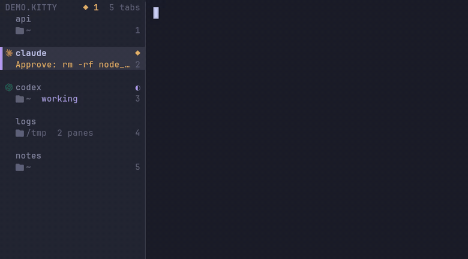

# kittymux

**Run a herd of AI coding agents in [kitty](https://sw.kovidgoyal.net/kitty/) — and always know which one needs you.**

A vertical tab bar, a sidebar deck and a few keystrokes that turn kitty into an
agent-aware workspace: named sessions, per-agent git worktrees, live
`working` / `waiting` / `done` status, and a one-key jump to whichever agent is
blocked on you. A *config layer*, not a daemon — Linux, Wayland, Hyprland-friendly,
zero background processes.

<p align="center">
  
</p>

## Try it in 30 seconds

```sh
git clone https://github.com/KitsuneKode/kittymux ~/kittymux
~/kittymux/bin/kittymux demo
```

`demo` opens an isolated window (its own config, state and theme — your kitty
config is never touched) with a sample session and a couple of fake agents in
different states. Press `ctrl+alt+b` for the deck, `ctrl+alt+y` to jump to the waiting agent,
`ctrl+space` then `?` for leader mode. Close the window and it is gone.

Like it? Install:

```sh
~/kittymux/install.sh            # add --leader for tmux-style leader mode
~/kittymux/bin/kittymux doctor   # tells you exactly what (if anything) is off
~/kittymux/bin/kittymux hooks --install   # Claude Code status hooks (backup first)
```

## What you get

- **A tab bar that reads like a workspace list.** Vertical rows (or a slim bottom bar):
  agent logo, title, git branch, pane count, and one status glyph — **◐ working**,
  **◆ waiting on you**, **✓ done** (shape *and* colour, so it is readable without colour vision).
  Every colour is derived from *your* kitty theme, so it follows theme switches.
- **Quiet tool glyphs.** Agents get their brand logo; recognised tools (editor, git, ssh, docker, node, python…) get a small muted glyph; a plain shell stays blank — so the icon column tells you what is running without adding noise.
- **The sidebar deck** (`ctrl+alt+b`). Every tab across every session, grouped, with live
  pane preview, hover/click, the agent's own message ("Approve: rm -rf node_modules?"), the
  PR number and listening ports (`:3000`).
- **A docked sidebar panel** (`ctrl+alt+shift+b`, Wayland). The deck as a persistent left column via
  `kitten panel`: the compositor reserves its width so tiled windows sit beside it — the cmux-style
  always-visible sidebar. ~1% CPU idle.
- **An attention queue** (`ctrl+alt+y`). One key jumps to the agent that has been waiting the
  longest — across sessions and OS windows. A desktop notification fires when an unfocused
  agent starts waiting.
- **Worktree per agent** (`ctrl+alt+shift+g`). Pick an agent, name a branch: kittymux creates
  `.worktrees/<branch>`, opens a tab and starts the agent there. Parallel agents never share a
  working tree.
- **Sessions that survive.** Tabs belong to named sessions; switching *parks* the current one
  (processes stay alive) and auto-checkpoints it. `ctrl+shift+space` is Kitty Home.
- **Leader mode** (opt-in). Tap `ctrl+space`, then one key — no modifier chords fighting your
  window manager. The bar shows a LEADER badge while armed; `?` shows the card.
- **Honest usage HUDs.** Real local numbers or "unavailable" — never fabricated. Network is opt-in.

### How is this different?

| | kittymux | [cmux](https://github.com/manaflow-ai/cmux) | [herdr](https://terminaltrove.com/herdr/) |
|---|---|---|---|
| What it is | config layer for kitty | its own macOS terminal (Ghostty-based) | multiplexer that runs *inside* a terminal |
| Platform | Linux (Wayland/X11) | macOS | cross-platform |
| Your terminal | stays kitty (GPU, ligatures, kittens) | replaces it | any |
| Processes | none (scripts + kitty's own API) | app | one binary |
| Agent state | hooks → window var (+ heuristic fallback) | notifications/hooks | process detection |

Pick the one that fits how you work; kittymux is for people who already live in kitty and don't
want a second multiplexer between them and their terminal.

## Install (details)

```sh
git clone https://github.com/KitsuneKode/kittymux ~/kittymux
~/kittymux/install.sh
```

The installer verifies deps (`kitty ≥ 0.48`, `jq`, `python3`, `fzf`, `git`), backs up
`kitty.conf`, adds the `include` lines, and symlinks `tab_bar.py` plus the helper modules.
Nothing is overwritten (existing files are backed up). Re-running is safe. Reload with
`ctrl+shift+alt+r`; a *new* kitty window picks up the tab bar (kitty caches a running
instance's `tab_bar.py`).

Add a remote-control socket if you don't have one:

```conf
allow_remote_control yes
listen_on unix:/tmp/mykitty
```

Arch: `packaging/PKGBUILD` builds `kittymux-git`.

## The mental model

```
OS window ──┬── session: work      (visible — bar shows these tabs only)
            ├── session: research  (parked — alive, hidden, auto-saved)
            └── session: misc      (parked)
```

- **Session** = a named group of tabs for one project/workspace.
- Switching sessions *parks* the current one — tabs and processes stay
  alive — and **auto-checkpoints** it to disk if it was saved before.
- `ctrl+shift+space` opens **Kitty Home**: one picker for every session
  op — jump, restore, create, rename, delete.

## Keymap spine

| Keys | Action |
|---|---|
| `ctrl+shift+space` | Kitty Home — all session ops |
| `ctrl+alt+,` / `ctrl+alt+.` | prev / next session |
| `ctrl+alt+shift+a` | last session |
| `ctrl+alt+t` / `+shift` | new tab beside / at end |
| `shift+←` / `shift+→` | prev / next tab (session-scoped) |
| `ctrl+alt+1..9` | jump to tab N |
| `ctrl+alt+h j k l` | pane nav (`shift+alt+arrows`) · `ctrl+alt+o` last pane |
| `ctrl+alt+enter` | split horizontal · `+shift` vertical |
| `ctrl+alt+d` / `+shift` | pane → new tab / chooser |
| `ctrl+alt+z` / `0` | zoom pane / equalize |
| `ctrl+alt+i` (×2) | cwd pill → detail card (copy path/branch) |
| `ctrl+alt+u` | agent usage HUD |
| `ctrl+alt+g` | agent picker — every agent pane, live preview + status + message |
| `ctrl+alt+y` | jump to the next agent waiting on you (round-robin, longest-waiting first) |
| `ctrl+alt+shift+g` | new agent in its own git worktree + tab |
| `ctrl+alt+b` | sidebar deck — tabs grouped by session, hover/click, live pane preview (`J`/`K` jump sessions) |
| `ctrl+alt+shift+b` | **docked sidebar panel** — the deck as an always-visible left column that reserves screen space (Wayland/Hyprland) |
| `ctrl+alt+;` | send a prompt to a background agent pane |
| `ctrl+alt+shift+e` | tab bar bottom → left → right |
| `ctrl+alt+\` | bar mode: full → slim rail → hidden ("zen") |
| `ctrl+alt+shift+[` / `]` | narrower / wider sidebar |
| `ctrl+alt+shift+l` | pick a layout preset (sidebar, rail, right, bottom, top, zen) |
| *drag the bar's inner edge* | resize the vertical bar with the mouse |
| `ctrl+alt+/` | keymap overlay — this table, parsed live from your conf |
| `ctrl+alt+shift+/` | last command output in pager |
| `ctrl+alt+[` / `]` | jump between shell prompts in scrollback |
| `alt+shift+hjkl` | resize pane |
| `ctrl+alt+q` | close pane (confirms if a process runs) |
| `ctrl+alt+shift+s` | save session now |
| `ctrl+space` then a key | **leader mode** (opt-in: `install.sh --leader`) — `?` shows the card |

When tmux is focused, only the keys tmux actually binds pass through
(`shift+←/→`, `ctrl+alt+←/→`, `ctrl+alt+z`) — everything else stays kitty's.
On Hyprland's scrolling layout the `ctrl+alt+` layer is WM-owned — kittymux
uses `ctrl+alt+g` (not `+a`), `shift+alt+arrows`, `ctrl+alt+0`, `ctrl+alt+q` so
nothing gets silently swallowed.

## Agent status hooks

Tab glyphs and the deck show what each agent is doing — **◐ working**, **◆ waiting** for
you, **✓ done** (clears when you look). Without hooks kittymux guesses from title
activity; with hooks it *knows*, and it also shows *why* the agent is waiting.

```sh
kittymux hooks --install      # merges the Claude Code hooks into ~/.claude/settings.json (backup first, idempotent)
kittymux hooks                # or just print the snippet
```

`bin/mux-status <working|waiting|done|idle>` is what the hooks call. It sets two window
variables — `kittymux_status` and `kittymux_msg` — that the watcher records and the bar
redraws on instantly. The message comes from `--msg`, from the hook's JSON on stdin
(Claude Code `Notification` → `.message`) or from a JSON last argument (Codex `notify` →
`.last-assistant-message`). It writes the OSC 1337 `SetUserVar` escape to the tty (works
over ssh, no socket needed) and falls back to kitty remote control. It never blocks or
fails the agent.

When an agent you are not looking at starts waiting, kittymux sends a desktop notification
(`notify-send`). Silence it with `touch ~/.local/state/kittymux/notify-off`.

Claude Code hooks, by hand:

```json
{
  "hooks": {
    "UserPromptSubmit": [{ "hooks": [{ "type": "command", "command": "~/kittymux/bin/mux-status working" }] }],
    "Notification":     [{ "hooks": [{ "type": "command", "command": "~/kittymux/bin/mux-status waiting" }] }],
    "Stop":             [{ "hooks": [{ "type": "command", "command": "~/kittymux/bin/mux-status done" }] }]
  }
}
```

Other agents: call `mux-status` from whatever hook/notify command they offer (extra arguments
are ignored). Inside tmux the escape needs passthrough; kittymux then falls back to remote
control (`listen_on` required).

## Leader mode

`install.sh --leader` (or `--leader=ctrl+a`) adds a tmux-style prefix built on kitty's modal
mappings: tap the leader, then **one** key. Unmapped keys or 2 s of silence cancel it, and the
tab bar shows a LEADER badge while it is armed.

| after leader | |
|---|---|
| `h j k l` `o` | focus pane · last pane |
| `\` `-` `z` `=` `x` `d` | split right/down · zoom · equalize · close pane · pane → tab |
| `c` `n` `p` `1…9` `r` `X` | new / next / prev / Nth tab · rename · close tab |
| `s` `P` | Kitty Home · project picker |
| `a` `w` `g` `;` | agent picker · **next waiting agent** · new worktree agent · send prompt |
| `b` `B` `u` `i` `e` | sidebar deck · docked panel · usage HUD · location pill · bar edge |
| `?` | the full card, generated from your leader config |

The default leader is `ctrl+space`. If you use nvim-cmp (which binds `<C-Space>`), pick another
with `--leader=ctrl+a`.

## Theme & colours

Nothing is hardcoded to a palette. `python/kittymux_theme.py` derives every
colour from your live kitty theme — pane, sidebar tint, active row, separator,
status colours (from the ANSI slots, contrast-checked) — so it follows theme
switches. Set `KITTYMUX_ACCENT=#rrggbb` to pin the accent (default: your
theme's `active_border_color`).

## Agent usage collectors

`python/collectors/*.py` — one file per provider, auto-discovered:

```python
def collect() -> dict:       # pure local reads, no spawns
def live(cached) -> dict:    # optional, only when KITTYMUX_USAGE_LIVE=1
```

Ships with codex (rollout rate-limit snapshots), claude (reconstructed
5h billing window + weekly burn), cursor (plan + AI-lines share), devin
(session/token activity). Add your own by dropping a file in — a broken
collector can never kill the HUD.

With `KITTYMUX_USAGE_LIVE=1`, collectors that expose `live()` also fetch
real quotas, cached ≥5min: claude via the OAuth usage endpoint, cursor via
`DashboardService/GetCurrentPeriodUsage` (monthly auto/api model pools +
spend), devin via `SeatManagementService/GetUserStatus` (daily/weekly
quota + overage balance). Network is strictly opt-in — everything works
offline.

## Tab bar layout & resizing

Layout is **per kitty instance** (all OS windows of one kitty share it), takes effect
instantly and survives config reloads: `kittymux layout <mode|edge|width|preset|pick|default|show>`.
New instances start from `kittymux layout default` (or your kitty.conf when nothing was chosen).

**Drag to resize.** Grab the vertical bar's inner edge (the separator line lights up while you
drag) and pull. The pointer is captured for the drag, so it works even outside the bar; release
saves the width for this kitty. Constraints:

- never narrower than 16 columns (a drag from the 9-column rail promotes it to the full sidebar);
- never wider than a third of the window — kitty's own cap for vertical bars — or 60 columns;
- a drag that goes silent for 2.5 s is abandoned, so the mouse can never stay captured.

Tab titles show only what fits; kitty does not deliver hover events to its tab bar, so for
richer per-tab detail use the deck (`ctrl+alt+b`) or the docked panel (`ctrl+alt+shift+b`,
also drag-resizable). Set `KITTYMUX_DEBUG=1` to log drag errors to `barsize-debug.log`.

## Layout

```
kittymux/
├── kittymux.conf          # options (path-free)
├── kittymux-keys.conf.tpl # keybinds → rendered by install.sh
├── install.sh
├── lib/mux.sh             # session model + remote-control plumbing
├── bin/mux-*              # sessionizer, nav, cycle, agents, save, HUDs…
├── bin/mux-status         # agent hooks → window status (working/waiting/done)
├── tests/                 # python3 -m unittest discover -s tests
└── python/
    ├── tab_bar.py         # custom tab bar (horizontal + vertical rows)
    ├── sidebar-kit.py     # ctrl+alt+b deck kitten (hover/click/preview)
    ├── pane-state.py      # watcher: per-window activity + agent status
    ├── kittymux_theme.py  # colour tokens derived from your kitty theme
    ├── kittymux_agents.py # agent table + status resolution
    ├── kittymux_layout.py # per-instance bar layout (geninclude) + drag maths
    ├── kittymux_barsize.py# drag-to-resize the vertical bar
    ├── kittymux_git.py    # branch/worktree reader (no subprocess)
    ├── kittymux_deck.py   # deck grouping/layout logic (pure, tested)
    └── collectors/        # usage plugins (_common.py shared helpers)
```

State lives in `${XDG_STATE_HOME}/kittymux` (`0700`, files `0600`).
Override with `KITTYMUX_STATE`. Optional vars: `KITTYMUX_PROJECTS`
(picker root), `KITTYMUX_USAGE_LIVE=1` (opt-in network quota fetch).

## Uninstall

Remove the three `include` lines from `kitty.conf`, the
`~/.config/kitty/tab_bar.py` symlink, and `~/.local/state/kittymux`.
