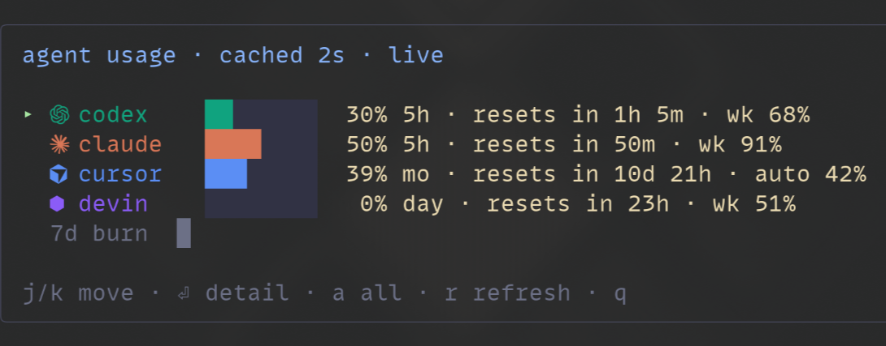

# kittymux

An agent-aware workspace layer for [kitty](https://sw.kovidgoyal.net/kitty/).
Named sessions, per-project tab groups, git-aware tab bar, usage HUDs for
agent CLIs — as a *config layer*, not a daemon.

<p align="center">
  
</p>

- **Zero daemon.** Everything is a shell script, one Python tab bar, and
  kitty's remote-control API. State is plain files.
- **Session-native.** Tabs belong to named sessions; parking hides them,
  restoring brings them back — checkpointed automatically on every switch.
- **Agent-aware.** Tab glyphs show which agent lives where — real brand
  marks (claude, codex, cursor, gemini, devin …) shipped as a tiny
  custom icon font wired through `symbol_map`. A usage HUD reads local
  provider state, with opt-in live quotas for claude/cursor/devin.
- **Honest data.** No fabricated percentages — collectors show real local
  numbers or say "unavailable". Network access is opt-in.

## Install

```sh
git clone https://github.com/KitsuneKode/kittymux ~/kittymux
~/kittymux/install.sh
```

The installer verifies deps (`kitty`, `jq`, `python3`, `fzf`, `git`),
backs up `kitty.conf`, adds three `include` lines, and symlinks
`tab_bar.py`. Nothing is overwritten. Reload with `ctrl+shift+alt+r`.

Add a remote-control socket if you don't have one:

```conf
listen_on unix:/tmp/mykitty
```

## The mental model

```
OS window ──┬── session: work      (visible — bar shows these tabs only)
            ├── session: research  (parked — alive, hidden, auto-saved)
            └── session: misc      (parked)
```

- **Session** = a named group of tabs for one project/workspace.
- Switching sessions *parks* the current one — tabs and processes stay
  alive — and **auto-checkpoints** it to disk if it was saved before.
- `ctrl+shift+space` opens **Kitty Home**: one picker for every session
  op — jump, restore, create, rename, delete.

## Keymap spine

| Keys | Action |
|---|---|
| `ctrl+shift+space` | Kitty Home — all session ops |
| `ctrl+alt+,` / `ctrl+alt+.` | prev / next session |
| `ctrl+alt+shift+a` | last session |
| `ctrl+alt+t` / `+shift` | new tab beside / at end |
| `shift+←` / `shift+→` | prev / next tab (session-scoped) |
| `ctrl+alt+1..9` | jump to tab N |
| `ctrl+alt+h j k l` | pane nav (`shift+alt+arrows`) · `ctrl+alt+o` last pane |
| `ctrl+alt+enter` | split horizontal · `+shift` vertical |
| `ctrl+alt+d` / `+shift` | pane → new tab / chooser |
| `ctrl+alt+z` / `0` | zoom pane / equalize |
| `ctrl+alt+i` (×2) | cwd pill → detail card (copy path/branch) |
| `ctrl+alt+u` | agent usage HUD |
| `ctrl+alt+g` | agent picker — every agent pane, live preview + status |
| `ctrl+alt+b` | sidebar deck — tabs grouped by session, hover/click, live pane preview (`J`/`K` jump sessions) |
| `ctrl+alt+;` | send a prompt to a background agent pane |
| `ctrl+alt+shift+e` | tab bar bottom → left → right |
| `ctrl+alt+/` | keymap overlay — this table, parsed live from your conf |
| `ctrl+alt+shift+/` | last command output in pager |
| `ctrl+alt+[` / `]` | jump between shell prompts in scrollback |
| `alt+shift+hjkl` | resize pane |
| `ctrl+alt+q` | close pane (confirms if a process runs) |
| `ctrl+alt+shift+s` | save session now |

When tmux is focused, only the keys tmux actually binds pass through
(`shift+←/→`, `ctrl+alt+←/→`, `ctrl+alt+z`) — everything else stays kitty's.
On Hyprland's scrolling layout the `ctrl+alt+` layer is WM-owned — kittymux
uses `ctrl+alt+g` (not `+a`), `shift+alt+arrows`, `ctrl+alt+0`, `ctrl+alt+q` so
nothing gets silently swallowed.

## Agent status hooks

Tab dots and the sidebar deck show what each agent is doing — **working**
(blue), **waiting** for you (amber), **done** (green, clears when you look).
Without hooks kittymux guesses from title activity; with hooks it *knows*.

`bin/mux-status <working|waiting|done|idle>` sets a window variable that the
watcher records and the tab bar redraws on instantly. It writes the OSC 1337
`SetUserVar` escape to the tty (works over ssh, no socket needed) and falls back
to kitty remote control. It never blocks or fails the calling agent.

Claude Code — add to `~/.claude/settings.json`:

```json
{
  "hooks": {
    "UserPromptSubmit": [{ "hooks": [{ "type": "command", "command": "~/kittymux/bin/mux-status working" }] }],
    "Notification":     [{ "hooks": [{ "type": "command", "command": "~/kittymux/bin/mux-status waiting" }] }],
    "Stop":             [{ "hooks": [{ "type": "command", "command": "~/kittymux/bin/mux-status done" }] }]
  }
}
```

Other agents: call `mux-status` from whatever hook/notify command they offer
(extra arguments are ignored). Inside tmux the escape needs passthrough; kittymux
then falls back to remote control (`listen_on` required).

## Theme & colours

Nothing is hardcoded to a palette. `python/kittymux_theme.py` derives every
colour from your live kitty theme — pane, sidebar tint, active row, separator,
status colours (from the ANSI slots, contrast-checked) — so it follows theme
switches. Set `KITTYMUX_ACCENT=#rrggbb` to pin the accent (default: your
theme's `active_border_color`).

## Agent usage collectors

`python/collectors/*.py` — one file per provider, auto-discovered:

```python
def collect() -> dict:       # pure local reads, no spawns
def live(cached) -> dict:    # optional, only when KITTYMUX_USAGE_LIVE=1
```

Ships with codex (rollout rate-limit snapshots), claude (reconstructed
5h billing window + weekly burn), cursor (plan + AI-lines share), devin
(session/token activity). Add your own by dropping a file in — a broken
collector can never kill the HUD.

With `KITTYMUX_USAGE_LIVE=1`, collectors that expose `live()` also fetch
real quotas, cached ≥5min: claude via the OAuth usage endpoint, cursor via
`DashboardService/GetCurrentPeriodUsage` (monthly auto/api model pools +
spend), devin via `SeatManagementService/GetUserStatus` (daily/weekly
quota + overage balance). Network is strictly opt-in — everything works
offline.

## Layout

```
kittymux/
├── kittymux.conf          # options (path-free)
├── kittymux-keys.conf.tpl # keybinds → rendered by install.sh
├── install.sh
├── lib/mux.sh             # session model + remote-control plumbing
├── bin/mux-*              # sessionizer, nav, cycle, agents, save, HUDs…
├── bin/mux-status         # agent hooks → window status (working/waiting/done)
├── tests/                 # python3 -m unittest discover -s tests
└── python/
    ├── tab_bar.py         # custom tab bar (horizontal + vertical rows)
    ├── sidebar-kit.py     # ctrl+alt+b deck kitten (hover/click/preview)
    ├── pane-state.py      # watcher: per-window activity + agent status
    ├── kittymux_theme.py  # colour tokens derived from your kitty theme
    ├── kittymux_agents.py # agent table + status resolution
    ├── kittymux_deck.py   # deck grouping/layout logic (pure, tested)
    └── collectors/        # usage plugins (_common.py shared helpers)
```

State lives in `${XDG_STATE_HOME}/kittymux` (`0700`, files `0600`).
Override with `KITTYMUX_STATE`. Optional vars: `KITTYMUX_PROJECTS`
(picker root), `KITTYMUX_USAGE_LIVE=1` (opt-in network quota fetch).

## Uninstall

Remove the three `include` lines from `kitty.conf`, the
`~/.config/kitty/tab_bar.py` symlink, and `~/.local/state/kittymux`.
